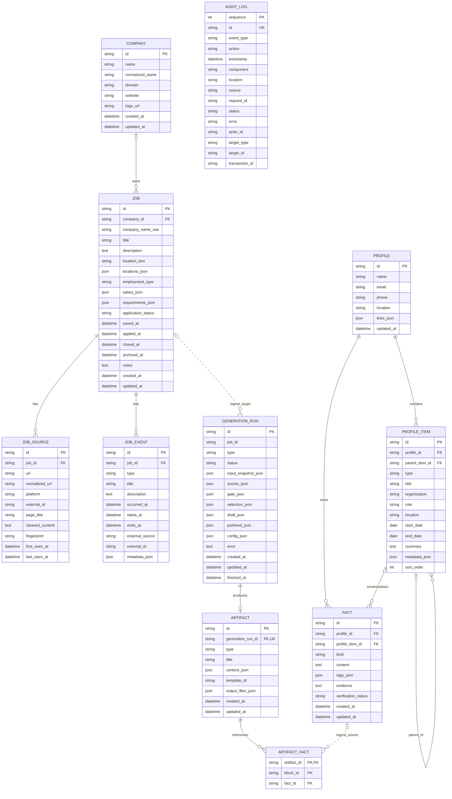

```mermaid
erDiagram
    direction TB

    COMPANY o|--o{ JOB : owns
    JOB ||--o{ JOB_SOURCE : has
    JOB ||--o{ JOB_EVENT : has
    JOB o|..o{ GENERATION_RUN : logical_target

    PROFILE ||--o{ PROFILE_ITEM : contains
    PROFILE ||--o{ FACT : owns
    PROFILE_ITEM o|--o{ FACT : contextualizes
    PROFILE_ITEM o|--o{ PROFILE_ITEM : parent_of

    GENERATION_RUN ||--o| ARTIFACT : produces
    ARTIFACT ||--o{ ARTIFACT_FACT : references
    FACT o|..o{ ARTIFACT_FACT : logical_source


    COMPANY {
        string id PK
        string name
        string normalized_name
        string domain
        string website
        string logo_url
        datetime created_at
        datetime updated_at
    }

    JOB {
        string id PK
        string company_id FK
        string company_name_raw
        string title
        text description
        string location_text
        json locations_json
        string employment_type
        json salary_json
        json requirements_json
        string application_status
        datetime saved_at
        datetime applied_at
        datetime closed_at
        datetime archived_at
        text notes
        datetime created_at
        datetime updated_at
    }

    JOB_SOURCE {
        string id PK
        string job_id FK
        string url
        string normalized_url
        string platform
        string external_id
        string page_title
        text cleaned_content
        string fingerprint
        datetime first_seen_at
        datetime last_seen_at
    }

    JOB_EVENT {
        string id PK
        string job_id FK
        string type
        string title
        text description
        datetime occurred_at
        datetime starts_at
        datetime ends_at
        string external_source
        string external_id
        json metadata_json
    }

    PROFILE {
        string id PK
        string name
        string email
        string phone
        string location
        json links_json
        datetime updated_at
    }

    PROFILE_ITEM {
        string id PK
        string profile_id FK
        string parent_item_id FK
        string type
        string title
        string organization
        string role
        string location
        date start_date
        date end_date
        text summary
        json metadata_json
        int sort_order
    }

    FACT {
        string id PK
        string profile_id FK
        string profile_item_id FK
        string kind
        text content
        json tags_json
        text evidence
        string verification_status
        datetime created_at
        datetime updated_at
    }

    GENERATION_RUN {
        string id PK
        string job_id
        string type
        string status
        json input_snapshot_json
        json scores_json
        json gate_json
        json selection_json
        json draft_json
        json polished_json
        json config_json
        text error
        datetime created_at
        datetime updated_at
        datetime finished_at
    }

    ARTIFACT {
        string id PK
        string generation_run_id FK,UK
        string type
        string title
        json content_json
        string template_id
        json output_files_json
        datetime created_at
        datetime updated_at
    }

    ARTIFACT_FACT {
        string artifact_id PK,FK
        string block_id PK
        string fact_id PK
    }

    AUDIT_LOG {
        int sequence PK
        string id UK
        string event_type
        string action
        datetime timestamp
        string component
        string location
        string source
        string request_id
        string status
        string error
        string actor_id
        string target_type
        string target_id
        string transaction_id
    }
```
