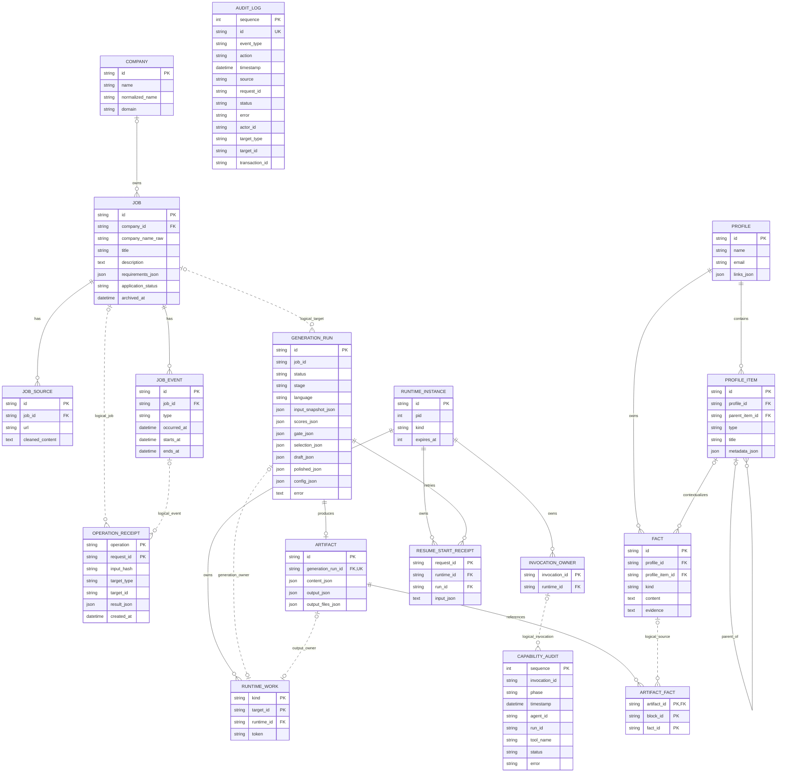

```mermaid
erDiagram
    direction TB
    COMPANY o|--o{ JOB : owns
    JOB ||--o{ JOB_SOURCE : has
    JOB ||--o{ JOB_EVENT : has
    JOB o|..o{ OPERATION_RECEIPT : logical_job
    JOB_EVENT o|..o{ OPERATION_RECEIPT : logical_event
    JOB o|..o{ GENERATION_RUN : logical_target
    PROFILE ||--o{ PROFILE_ITEM : contains
    PROFILE ||--o{ FACT : owns
    PROFILE_ITEM o|--o{ FACT : contextualizes
    PROFILE_ITEM o|--o{ PROFILE_ITEM : parent_of
    GENERATION_RUN ||--o| ARTIFACT : produces
    ARTIFACT ||--o{ ARTIFACT_FACT : references
    FACT o|..o{ ARTIFACT_FACT : logical_source
    RUNTIME_INSTANCE ||--o{ RUNTIME_WORK : owns
    RUNTIME_INSTANCE ||--o{ INVOCATION_OWNER : owns
    RUNTIME_INSTANCE ||--o{ RESUME_START_RECEIPT : owns
    GENERATION_RUN ||--o{ RESUME_START_RECEIPT : retries
    GENERATION_RUN o|..o| RUNTIME_WORK : generation_owner
    ARTIFACT o|..o| RUNTIME_WORK : output_owner
    INVOCATION_OWNER o|..o{ CAPABILITY_AUDIT : logical_invocation

    OPERATION_RECEIPT {
        string operation PK
        string request_id PK
        string input_hash
        string target_type
        string target_id
        json result_json
        datetime created_at
    }
    COMPANY {
        string id PK
        string name
        string normalized_name
        string domain
    }
    JOB {
        string id PK
        string company_id FK
        string company_name_raw
        string title
        text description
        json requirements_json
        string application_status
        datetime archived_at
    }
    JOB_SOURCE {
        string id PK
        string job_id FK
        string url
        text cleaned_content
    }
    JOB_EVENT {
        string id PK
        string job_id FK
        string type
        datetime occurred_at
        datetime starts_at
        datetime ends_at
    }
    PROFILE {
        string id PK
        string name
        string email
        json links_json
    }
    PROFILE_ITEM {
        string id PK
        string profile_id FK
        string parent_item_id FK
        string type
        string title
        json metadata_json
    }
    FACT {
        string id PK
        string profile_id FK
        string profile_item_id FK
        string kind
        text content
        text evidence
    }
    GENERATION_RUN {
        string id PK
        string job_id
        string status
        string stage
        string language
        json input_snapshot_json
        json scores_json
        json gate_json
        json selection_json
        json draft_json
        json polished_json
        json config_json
        text error
    }
    ARTIFACT {
        string id PK
        string generation_run_id FK,UK
        json content_json
        json output_json
        json output_files_json
    }
    ARTIFACT_FACT {
        string artifact_id PK,FK
        string block_id PK
        string fact_id PK
    }
    AUDIT_LOG {
        int sequence PK
        string id UK
        string event_type
        string action
        datetime timestamp
        string source
        string request_id
        string status
        string error
        string actor_id
        string target_type
        string target_id
        string transaction_id
    }
    CAPABILITY_AUDIT {
        int sequence PK
        string invocation_id
        string phase
        datetime timestamp
        string agent_id
        string run_id
        string tool_name
        string status
        string error
    }
    RUNTIME_INSTANCE {
        string id PK
        int pid
        string kind
        int expires_at
    }
    RUNTIME_WORK {
        string kind PK
        string target_id PK
        string runtime_id FK
        string token
    }
    INVOCATION_OWNER {
        string invocation_id PK
        string runtime_id FK
    }
    RESUME_START_RECEIPT {
        string request_id PK
        string runtime_id FK
        string run_id FK
        text input_json
    }
```
