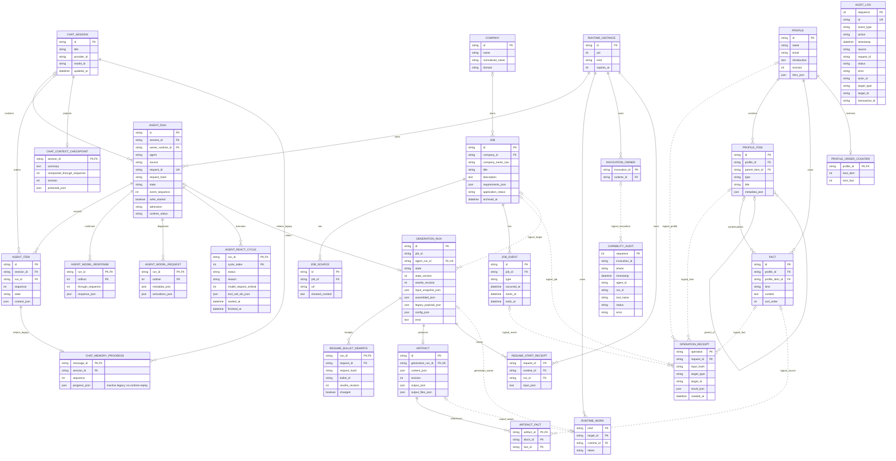

```mermaid
erDiagram
    direction TB
    CHAT_SESSION o|--o{ AGENT_RUN : contains
    CHAT_SESSION o|--o{ AGENT_ITEM : orders
    AGENT_RUN ||--o{ AGENT_ITEM : records
    AGENT_RUN ||--o{ AGENT_MODEL_RESPONSE : continues
    AGENT_RUN ||--o{ AGENT_MODEL_REQUEST : diagnoses
    AGENT_RUN ||--o{ AGENT_REACT_CYCLE : executes
    CHAT_SESSION ||--o| CHAT_CONTEXT_CHECKPOINT : projects
    CHAT_SESSION ||--o{ CHAT_MEMORY_PROGRESS : retains_legacy
    AGENT_ITEM ||--o| CHAT_MEMORY_PROGRESS : retains_legacy
    RUNTIME_INSTANCE ||--o{ AGENT_RUN : owns
    COMPANY o|--o{ JOB : owns
    JOB ||--o{ JOB_SOURCE : has
    JOB ||--o{ JOB_EVENT : has
    JOB o|..o{ OPERATION_RECEIPT : logical_job
    JOB_EVENT o|..o{ OPERATION_RECEIPT : logical_event
    JOB o|..o{ GENERATION_RUN : logical_target
    PROFILE o|..o{ OPERATION_RECEIPT : logical_profile
    PROFILE_ITEM o|..o{ OPERATION_RECEIPT : logical_item
    FACT o|..o{ OPERATION_RECEIPT : logical_fact
    PROFILE ||--o{ PROFILE_ITEM : contains
    PROFILE ||--o{ FACT : owns
    PROFILE ||--o| PROFILE_ORDER_COUNTER : reserves
    PROFILE_ITEM o|--o{ FACT : contextualizes
    PROFILE_ITEM o|--o{ PROFILE_ITEM : parent_of
    AGENT_RUN o|--o| GENERATION_RUN : tailors
    GENERATION_RUN ||--o{ RESUME_BULLET_REWRITE : receipts
    GENERATION_RUN ||--o| ARTIFACT : produces
    ARTIFACT ||--o{ ARTIFACT_FACT : references
    FACT o|..o{ ARTIFACT_FACT : logical_source
    RUNTIME_INSTANCE ||--o{ RUNTIME_WORK : owns
    RUNTIME_INSTANCE ||--o{ INVOCATION_OWNER : owns
    RUNTIME_INSTANCE ||--o{ RESUME_START_RECEIPT : owns
    GENERATION_RUN ||--o{ RESUME_START_RECEIPT : retries
    GENERATION_RUN o|..o| RUNTIME_WORK : generation_owner
    ARTIFACT o|..o| RUNTIME_WORK : output_owner
    INVOCATION_OWNER o|..o{ CAPABILITY_AUDIT : logical_invocation

    CHAT_SESSION {
        string id PK
        string title
        string provider_id
        string model_id
        datetime updated_at
    }
    AGENT_RUN {
        string id PK
        string session_id FK
        string owner_runtime_id FK
        string agent
        string source
        string request_id UK
        string request_hash
        string state
        int event_sequence
        boolean write_started
        string admission
        string runtime_status
    }
    AGENT_ITEM {
        string id PK
        string session_id FK
        string run_id FK
        int sequence
        string state
        json content_json
    }
    AGENT_MODEL_RESPONSE {
        string run_id PK,FK
        int ordinal PK
        int through_sequence
        json response_json
    }
    AGENT_MODEL_REQUEST {
        string run_id PK,FK
        int ordinal PK
        json metadata_json
        json activations_json
    }
    AGENT_REACT_CYCLE {
        string run_id PK,FK
        int cycle_index PK
        string status
        string reason
        int model_request_ordinal
        json tool_call_ids_json
        datetime started_at
        datetime finished_at
    }
    CHAT_CONTEXT_CHECKPOINT {
        string session_id PK,FK
        text summary
        int compacted_through_sequence
        int revision
        json protected_json
    }
    CHAT_MEMORY_PROGRESS {
        string message_id PK,FK
        string session_id FK
        int sequence
        json progress_json "inactive legacy; no runtime replay"
    }
    OPERATION_RECEIPT {
        string operation PK
        string request_id PK
        string input_hash
        string target_type
        string target_id
        json result_json
        datetime created_at
    }
    COMPANY {
        string id PK
        string name
        string normalized_name
        string domain
    }
    JOB {
        string id PK
        string company_id FK
        string company_name_raw
        string title
        text description
        json requirements_json
        string application_status
        datetime archived_at
    }
    JOB_SOURCE {
        string id PK
        string job_id FK
        string url
        text cleaned_content
    }
    JOB_EVENT {
        string id PK
        string job_id FK
        string type
        datetime occurred_at
        datetime starts_at
        datetime ends_at
    }
    PROFILE {
        string id PK
        string name
        string email
        text introduction
        int revision
        json links_json
    }
    PROFILE_ORDER_COUNTER {
        string profile_id PK,FK
        int next_item
        int next_fact
    }
    PROFILE_ITEM {
        string id PK
        string profile_id FK
        string parent_item_id FK
        string type
        string title
        json metadata_json
    }
    FACT {
        string id PK
        string profile_id FK
        string profile_item_id FK
        string kind
        text content
        int sort_order
    }
    GENERATION_RUN {
        string id PK
        string job_id
        string agent_run_id FK,UK
        string state
        int state_version
        int rewrite_revision
        json input_snapshot_json
        json assembled_json
        json legacy_payload_json
        json config_json
        text error
    }
    RESUME_BULLET_REWRITE {
        string run_id PK,FK
        string request_id PK
        string request_hash
        string bullet_id
        int rewrite_revision
        boolean changed
    }
    ARTIFACT {
        string id PK
        string generation_run_id FK,UK
        json content_json
        int revision
        json output_json
        json output_files_json
    }
    ARTIFACT_FACT {
        string artifact_id PK,FK
        string block_id PK
        string fact_id PK
    }
    AUDIT_LOG {
        int sequence PK
        string id UK
        string event_type
        string action
        datetime timestamp
        string source
        string request_id
        string status
        string error
        string actor_id
        string target_type
        string target_id
        string transaction_id
    }
    CAPABILITY_AUDIT {
        int sequence PK
        string invocation_id
        string phase
        datetime timestamp
        string agent_id
        string run_id
        string tool_name
        string status
        string error
    }
    RUNTIME_INSTANCE {
        string id PK
        int pid
        string kind
        int expires_at
    }
    RUNTIME_WORK {
        string kind PK
        string target_id PK
        string runtime_id FK
        string token
    }
    INVOCATION_OWNER {
        string invocation_id PK
        string runtime_id FK
    }
    RESUME_START_RECEIPT {
        string request_id PK
        string runtime_id FK
        string run_id FK
        text input_json
    }
```
